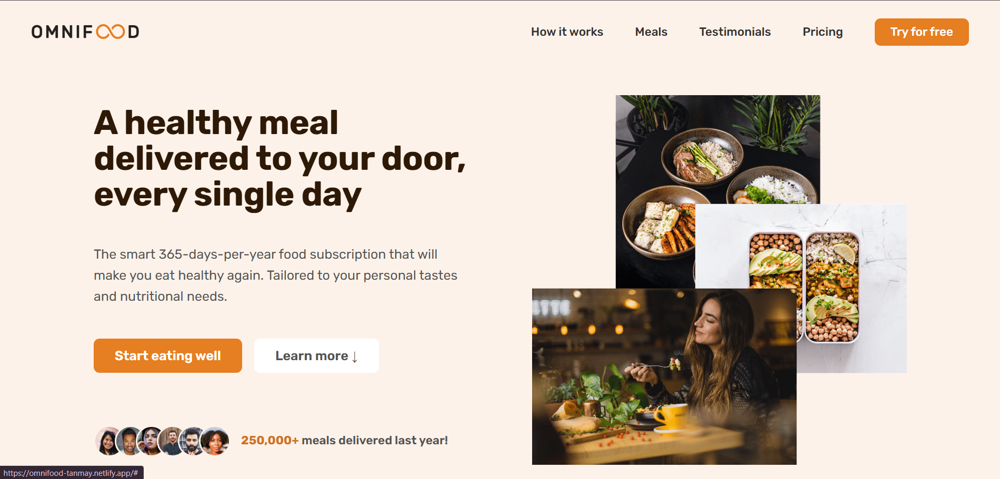
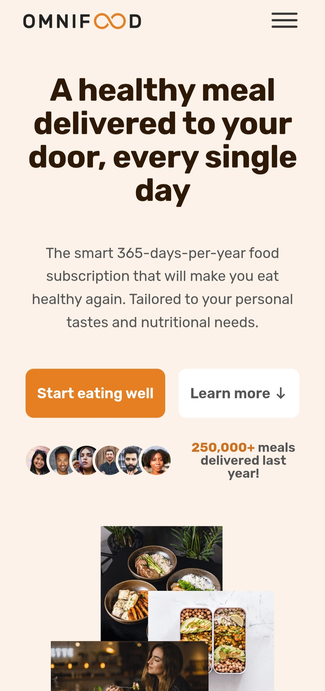

# 🍽️ Omnifood Website

## 🚀 Project Overview
A fully responsive food delivery website built using **HTML** and **CSS**, inspired by modern UI/UX practices. This project focuses on creating clean layouts, reusable components, and a seamless user experience across devices.

## 🛠️ Technologies Used
- HTML5
- CSS3
- Flexbox
- CSS Grid

## ✨ Features
- Responsive design for all screen sizes
- Smooth scrolling navigation
- Clean and modern UI
- Well-structured layout using Grid & Flexbox

## 📸 Screenshots

### 💻 Desktop View

### 📱 Mobile View

## 🌐 Live Demo
👉 [View Website](https://omnifood-tanmay.netlify.app/)

## 💻 Source Code
👉 [GitHub Repository](https://github.com/beastboytg/OMNIFOOD-Project)
